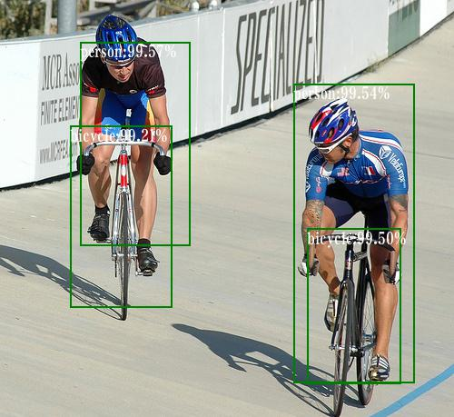
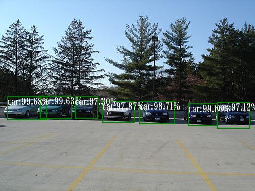

# YOLOv1

**This not the same as the original [paper](https://arxiv.org/pdf/1506.02640.pdf). My Results on voc07test is 0.684 map, 76fps@RTX2080Ti**

My backbone network is resnet50, add a few 1x1 and 3x3 conv to fine-tune the resnet. I also change the 7x7 feature maps to 14x14 feature maps and use the fully convolutional instead of convolution & fully connected which has been Implemented in the original paper.

## Train on voc2012+2007
| model                | backbone | map@voc2007test  | FPS  |
| -------------------- | -------------- | ---------- | -------   |
| our ResNet_YOLO  |   ResNet50        | 66.5%      |  57   |
| YOLO  |   darknet19?        | 63.4%      |  45   |
| YOLO VGG-16  |   VGG-16        | 66.4%      |  21   |

### 1. Prerequisites
- pytorch 0.2.0_2
- opencv
- numpy

### 2. Prepare

1. Download voc2012train adn voc2007 dataset
2. Download voc2007test dataset

### 3. Train
Run python train.py

